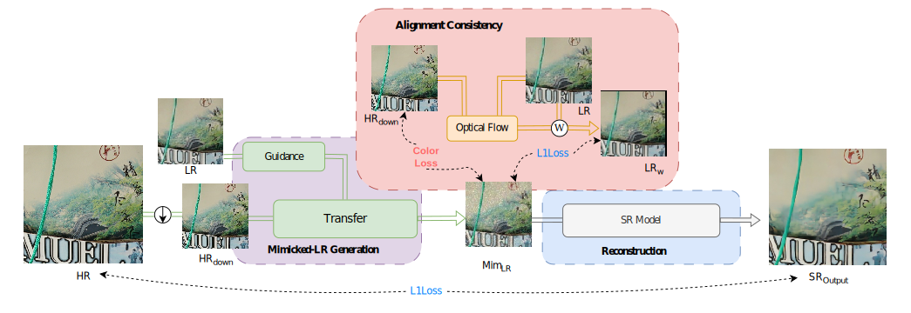
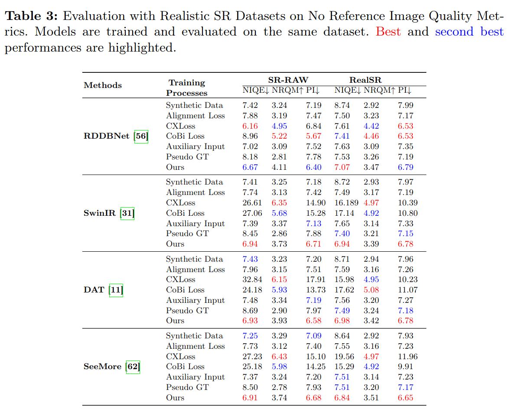

# Mimicked Alignment for Real-World SR - ACCV 2024


### Enhanced Super-Resolution Training via Mimicked Alignment for Real-World Scenes

#### [Omar Elezabi](https://scholar.google.de/citations?user=8v3dYzEAAAAJ&hl=en), [Zongwei Wu<sup>*</sup>](https://sites.google.com/view/zwwu/accueil), and [Radu Timofte](https://www.informatik.uni-wuerzburg.de/computervision/)

#### **Computer Vision Lab, CAIDAS & IFI, University of Würzburg**
#### **<sup>*</sup> Corresponding authors**

[]()
[]()
<!-- []() -->

## Latest
<!-- - `05/10/2024`: Added 🤗[Demo](). -->
- `07/10/2024`: Code & ckpt & results release. [Google Drive]()
- `07/10/2024`: Technical report released on [arxiv]().
- `20/09/2024`: Paper has been accepted at ACCV 2024! 🎉 


## Method:
<br>
<details>
  <summary>
  <font size="+1">Abstract</font>
  </summary>
Image super-resolution methods have made significant strides with deep learning techniques and ample training data. However, they face challenges due to inherent misalignment between low-resolution (LR) and high-resolution (HR) pairs in real-world datasets. In this study, we propose a novel plug-and-play module designed to mitigate these misalignment issues by aligning LR inputs with HR images during training. Specifically, our approach involves mimicking a novel LR sample that aligns with HR while preserving the degradation characteristics of the original LR samples. This module seamlessly integrates with any SR model, enhancing robustness against misalignment. Importantly, it can be easily removed during inference, therefore without introducing any parameters on the conventional SR models. We comprehensively evaluate our method on synthetic and real-world datasets, demonstrating its effectiveness across a spectrum of SR models, including traditional CNNs and state-of-the-art Transformers.
</details>


**Mimicked Alignment:**

<p align="center">

</p>

<p align="center">

</p>


## Results:

<details>
  <summary>
  <font size="+1">Main Results</font>
  </summary>
<p align="center">

</p>
</details>

<details>
  <summary>
  <font size="+1">Visual Comparison</font>
  </summary>

  <p align="center">
  
  </p>
  <p align="center">
  
  </p>

</details>

## Install
installation for Cuda 12.2 and Pytorch 2.4\
Create a conda enviroment:
````
ENV_NAME="Mim_Ali"
conda create -n $ENV_NAME python=3.10.*
conda activate $ENV_NAME
````
Install the dependencies:
````
pip3 install torch torchvision torchaudio
pip3 install -r requirements.txt
python setup.py develop --no_cuda_ext
````


## Usage
Pre-trained checkpoints and visual results can be downloaded [here]().

In `options` you can find the corresponding config files for reproducing our experiments.

##### **Testing**
For testing the pre-trained SR model with our Alignment please use following commands To generate output. Replace `[TEST OPT YML]` with the path to the corresponding option file.
`````
python basicsr/test.py -opt [TEST OPT YML]
`````
Measure the No Reference metric on the output images.
`````
python scripts/no_ref_quality.py --metric [Metric Name (niqe,nrqm,pi)] --imgs_path [Images Folder]
`````

##### **Training**
For single-GPU training use the following commands. Replace `[TRAIN OPT YML]` with the path to the corresponding option file.
`````
python basicsr/train.py -opt [TRAIN OPT YML] 
`````

## Citation

If you find our work helpful, please consider citing the following paper and/or ⭐ the repo.

```

```

## Acknowledgements

This code is built on [NAFNet](https://github.com/megvii-research/NAFNet).